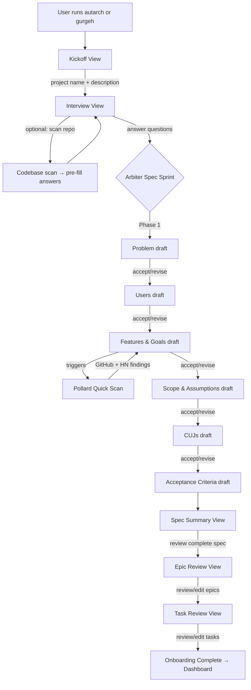
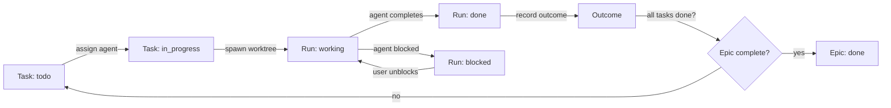
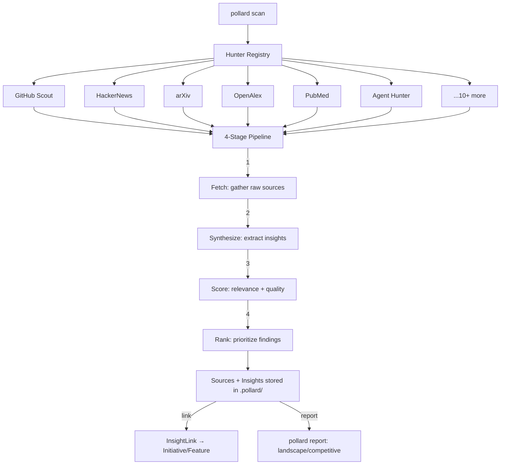
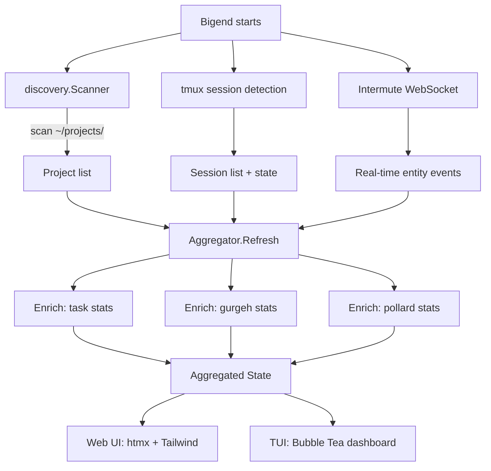

# Autarch: Project & Module Interaction Flows

> Comprehensive guide to how Gurgeh, Coldwine, Pollard, and Bigend interact — from new-project onboarding through ongoing execution, research, and mission control.

---

## 1. Architecture Overview

```
                          +---------------------------+
                          |         BIGEND             |
                          |    Mission Control         |
                          |  (Web + TUI dashboard)     |
                          +-----+----------+----------+
                                |          |
                     WebSocket  |          |  discovery.Scanner
                     events     |          |  (project enumeration)
                                |          |
     +----------+----------+---+----------+---+----------+----------+
     |                     EVENT SPINE                               |
     |              (~/.autarch/events.db)                           |
     |  SQLite-backed durable log: Initiative/Epic/Story/Task/Run    |
     +---+-------------------+-------------------+------------------+
         |                   |                   |
         v                   v                   v
   +-----------+      +------------+      +------------+
   |  GURGEH   |      |  COLDWINE  |      |  POLLARD   |
   |  PRD Gen  |      |  Task Orch |      |  Research  |
   |  Arbiter  |      |  Epics     |      |  Hunters   |
   +-----------+      +------------+      +------------+
         |                   |                   |
         +-------------------+-------------------+
                             |
                     +-------+-------+
                     |   INTERMUTE   |
                     | REST+WS+Embed |
                     | Spec, Insight |
                     | CUJ, Session  |
                     +---------------+
```

**Communication layers:**

| Layer | Transport | Purpose | Backing |
|-------|-----------|---------|---------|
| **Event Spine** | `pkg/events` | Durable cross-tool event log | SQLite (`~/.autarch/events.db`) |
| **Intermute** | `pkg/intermute` | Real-time entity CRUD + messaging | REST + WebSocket + embedded |
| **Contract Types** | `pkg/contract` | Shared entity definitions | Go types (compile-time) |

---

## 2. New Project Flow

A new project moves through Gurgeh (spec creation) → Coldwine (task generation) → agents (execution), with Pollard providing research at multiple stages and Bigend observing throughout.



### Step-by-step

1. **Kickoff** (`internal/tui/unified_app.go` — `ModeOnboarding`)
   - User provides project name, description, and path.
   - `UnifiedApp` creates an `Initiative` via `pkg/contract`.
   - Emits `EventInitiativeCreated` on the event spine.

2. **Interview** (`internal/gurgeh/tui/interview.go`)
   - 11-step interview state machine (scan → draft → bootstrap → vision → users → problem → goals → non-goals → assumptions → requirements → research).
   - Each step uses a dual-pane layout: form on left, chat transcript on right.
   - **Agent iteration loop**: user enters answer → AI agent refines → user accepts or re-enters.
   - Optional repo scan pre-fills answers from codebase analysis.

3. **Arbiter Spec Sprint** (`internal/gurgeh/arbiter/orchestrator.go`)
   - Six-phase propose-first flow: Problem → Users → Features/Goals → Scope/Assumptions → CUJs → Acceptance Criteria.
   - Each phase produces a `SectionDraft` with 2–3 alternative phrasings (`Options`).
   - User can `AcceptDraft()` or `ReviseDraft()` with tracked edit history.
   - **Consistency engine** (`arbiter/consistency/`) validates cross-section coherence after each advance.
   - **Confidence scoring** (`arbiter/confidence/`) rates completeness (20%), consistency (25%), specificity (20%), research (20%), assumptions (15%).
   - At the Features/Goals phase, a **quick scan** fires Pollard's Ranger adapter to fetch GitHub + HN results.

4. **Spec Summary** — User reviews the complete `Spec` (`internal/gurgeh/specs/schema.go`).

5. **Epic Generation** — Spec → `[]EpicProposal` with stories, acceptance criteria, risks, and estimates (`internal/coldwine/epics/types.go`).

6. **Task Generation** (`internal/coldwine/tasks/generate.go`)
   - `Generator.GenerateFromEpics()` walks each epic → each story → produces `TaskProposal` entries.
   - Task types: `implementation`, `test`, `documentation`, `review`, `setup`, `research`.
   - `ResolveCrossEpicDependencies()` links tasks across epic boundaries.
   - `BuildDependencyGraph()` produces a DAG for execution ordering.

7. **Transition to Dashboard** — `UnifiedApp` switches from `ModeOnboarding` to `ModeDashboard`. Bigend begins aggregation.

---

## 3. Ongoing Project Flow

Once a project has a spec, epics, and tasks, Coldwine manages execution while Bigend monitors.



### Task Assignment

1. **Ready tasks** — `tasks.GetReadyTasks()` returns tasks with all dependencies met.
2. **Agent resolution** — `pkg/agenttargets/resolver.go` resolves agent name to command:
   - Resolution order: **project registry** → **global registry** → **auto-detected** (claude, codex, gemini).
   - Returns `ResolvedTarget` with command, args, env, and source context.
3. **Worktree creation** — Each task gets an isolated git worktree (via Coldwine coordination).
4. **Session management** — Bigend's tmux integration tracks active sessions.

### Run Lifecycle

| State | Meaning | Detected By |
|-------|---------|-------------|
| `working` | Agent actively producing output | Pane activity patterns |
| `waiting` | Agent waiting for user input | Prompt detection |
| `blocked` | Agent hit an obstacle | Repetition / error patterns |
| `stalled` | No activity for extended period | Activity timeout |
| `done` | Task completed | Exit detection |
| `error` | Agent crashed or failed | Error pattern matching |

State detection uses NudgeNik-style heuristics in `internal/bigend/statedetect/` — capturing tmux pane content and matching against known patterns with confidence scores.

### Completion Tracking

- Each `Run` produces an `Outcome` (success/failure + artifacts + summary).
- Events propagate up: `EventTaskCompleted` → check if epic is done → `EventEpicClosed` → check if initiative is done → `EventInitiativeClosed`.
- Bigend's aggregator enriches project state with task/epic/pollard stats via `enrichWithTaskStats()`, `enrichWithGurgStats()`, `enrichWithPollardStats()`.

---

## 4. Research Flow (Pollard)

Pollard provides continuous research intelligence across multiple domains.



### Hunter Interface (`internal/pollard/hunters/hunter.go`)

```go
type Hunter interface {
    Name() string
    Hunt(ctx context.Context, cfg HunterConfig) (*HuntResult, error)
}
```

All 15 hunters implement this interface. The `DefaultRegistry()` returns:

| Category | Hunters | API Keys? |
|----------|---------|-----------|
| **Tech** | GitHub Scout, HackerNews, arXiv, Competitor Tracker | GitHub optional |
| **Academic** | OpenAlex (multi-domain), PubMed | No |
| **Domain** | USDA (agriculture), Legal (CourtListener), Economics, Wiki | USDA/Court keys |
| **Agent** | Agent Hunter (primary research mechanism) | Agent command |
| **Docs** | Context7 (framework documentation) | No |

### Pipeline Options

The `PipelineOptions` struct controls agent-native synthesis:

```go
type PipelineOptions struct {
    FetchREADME      bool          // Fetch GitHub READMEs
    Synthesize       bool          // Run AI synthesis
    SynthesizeLimit  int           // Max items to synthesize
    AgentCmd         string        // Agent command for synthesis
    AgentParallelism int           // Concurrent agent invocations
    AgentTimeout     time.Duration // Per-agent timeout
}
```

### Insight Linking

Pollard insights connect to the entity hierarchy via `InsightLink` (`pkg/contract/types.go`):

```go
type InsightLink struct {
    InsightID    string
    InitiativeID string
    FeatureRef   string
    LinkedAt     time.Time
    LinkedBy     string // "pollard", "user", "gurgeh"
}
```

This allows Gurgeh specs and Coldwine tasks to reference specific research findings.

---

## 5. Mission Control Flow (Bigend)

Bigend is the read-heavy aggregation layer — it discovers projects, monitors agents, and presents a unified dashboard.



### Aggregator State (`internal/bigend/aggregator/aggregator.go`)

The `State` struct is the central read model:

```go
type State struct {
    Projects   []discovery.Project
    Agents     []Agent
    Sessions   []TmuxSession
    MCP        map[string][]mcp.ComponentStatus
    Activities []Activity
    UpdatedAt  time.Time
}
```

**Refresh cycle:**
1. `discovery.Scanner` enumerates projects under configured paths.
2. tmux client lists sessions; `statedetect.Detector` classifies each as working/waiting/blocked/stalled.
3. Intermute WebSocket delivers real-time events (task completions, agent messages).
4. Enrichment methods pull tool-specific stats from each project's local data.

**Event handlers** (`Aggregator.On()`) allow reactive updates — e.g., when a task completes, the dashboard refreshes immediately.

---

## 6. Module Interaction Map

How each `pkg/` package connects the tools:

```
pkg/contract/       pkg/events/         pkg/intermute/
  types.go            types.go            client.go
  ┌─────────┐         ┌──────────┐        ┌──────────────┐
  │Initiative│         │Event     │        │Spec CRUD     │
  │Epic      │◄───────►│EventType │        │Epic CRUD     │
  │Story     │  used   │EventFilter│       │Task CRUD     │
  │Task      │  by     │Subscription│      │CUJ CRUD      │
  │Run       │  all    │EventBus  │        │Insight CRUD  │
  │Outcome   │  tools  │          │        │Session CRUD  │
  │InsightLink│        └──────────┘        │Agent ops     │
  └─────────┘              │               │WebSocket     │
       │                   │               └──────────────┘
       │                   │                     │
       ▼                   ▼                     ▼
  pkg/agenttargets/   pkg/tui/            pkg/discovery/
  resolver.go         shelllayout.go      scanner.go
  ┌──────────────┐    ┌──────────────┐    ┌──────────────┐
  │Resolve agent │    │3-pane layout │    │Find projects │
  │by name       │    │Sidebar+Doc+  │    │in filesystem │
  │project→global│    │Chat          │    │Detect tools  │
  │→auto-detect  │    │Focus mgmt   │    │present       │
  └──────────────┘    │Tokyo Night   │    └──────────────┘
                      └──────────────┘
```

### Dependency Graph

| Package | Used By |
|---------|---------|
| `pkg/contract` | All tools (shared entity types) |
| `pkg/events` | All tools (emit + subscribe to events) |
| `pkg/intermute` | Gurgeh (publish specs), Coldwine (task assignment), Bigend (aggregate), Pollard (insight linking) |
| `pkg/tui` | Gurgeh TUI, Coldwine TUI, Bigend TUI, Unified app |
| `pkg/agenttargets` | Coldwine (resolve agent for task), Bigend (display agent info) |
| `pkg/discovery` | Bigend (enumerate projects) |
| `pkg/autarch` | Unified TUI app (`internal/tui/unified_app.go`) — client library wrapping all tools |

---

## 7. Agent Integration

### Resolution (`pkg/agenttargets/resolver.go`)

```go
type Resolver struct {
    global, project, detected Registry
}
// Resolution: project → global → detected (claude, codex, gemini)
```

Agents are resolved by name with context (`global`, `project`, `spawn`). The resolver checks project-local config first, then global config, then auto-detected agents on the system.

### Agent Lifecycle

1. **Resolve** — `Resolver.Resolve(ctx, name)` → `ResolvedTarget` (command, args, env).
2. **Spawn** — Coldwine creates a tmux session + git worktree for the task.
3. **Monitor** — Bigend's `statedetect.Detector` reads tmux pane content to classify agent state.
4. **Communicate** — Intermute provides agent messaging: `SendMessage()`, `AgentMessages()`, inbox enrichment.
5. **Complete** — Agent finishes → `Run` state transitions to `done` → `Outcome` recorded.

### Intermute Agent Operations

```go
// Agent-aware operations from pkg/intermute/client.go
client.ListAgentsEnriched()    // All agents with inbox counts
client.AgentMessages(agentID)  // Messages for specific agent
client.AgentReservations(id)   // File reservations held by agent
client.SendMessage(msg)        // Send to agent inbox
client.Reserve(path, agentID)  // Reserve file for exclusive edit
```

### Brief Generation

At the end of the interview flow, Gurgeh generates a **research brief** that Pollard can consume. This bridges spec creation and research:

- Interview step 11 (`research prompt`) produces research queries.
- `research.Coordinator` (`internal/gurgeh/research/`) manages the handoff.
- The unified app passes the coordinator through view factories so research context flows from interview → spec summary → task detail.

---

## 8. Data Model

### Entity Hierarchy

```
Initiative (project-level intent)
  ├── Epic (major feature area)
  │     ├── Story (user-facing capability)
  │     │     ├── Task (atomic work item)
  │     │     │     ├── Run (single agent execution)
  │     │     │     │     └── Outcome (result + artifacts)
  │     │     │     └── Run ...
  │     │     └── Task ...
  │     └── Story ...
  └── Epic ...

InsightLink (cross-reference: Insight ↔ Initiative/Feature)
```

### Key Types (from `pkg/contract/types.go`)

| Entity | Key Fields | Status Values |
|--------|-----------|---------------|
| `Initiative` | ID, Title, Status, Priority, SourceTool, ProjectPath | draft, open, in_progress, done, closed |
| `Epic` | ID, InitiativeID, FeatureRef, Title, Priority | draft, open, in_progress, done, closed |
| `Story` | ID, EpicID, Title, Complexity, Assignee | draft, open, in_progress, done, closed |
| `Task` | ID, StoryID, Title, WorktreeRef, SessionRef | todo, in_progress, blocked, done |
| `Run` | ID, TaskID, AgentName, AgentProgram, WorktreePath | working, waiting, blocked, done |
| `Outcome` | ID, RunID, Summary, Success, Artifacts | (terminal — no status) |
| `InsightLink` | InsightID, InitiativeID, FeatureRef, LinkedBy | (link — no status) |

### Gurgeh-Specific Types

**Spec** (`internal/gurgeh/specs/schema.go`):

| Field | Type | Purpose |
|-------|------|---------|
| `StrategicContext` | struct | Vision, market position |
| `UserStory` | struct | As-a / I-want / So-that |
| `Goals` | `[]Goal` | ID + description + metric + target |
| `NonGoals` | `[]NonGoal` | ID + description + rationale |
| `Assumptions` | `[]Assumption` | ID + description + impact-if-false + confidence |
| `CriticalUserJourneys` | `[]CriticalUserJourney` | Steps + success criteria + linked requirements |
| `MarketResearch` | `[]MarketResearchItem` | Competitive intelligence |

**Arbiter SprintState** (`internal/gurgeh/arbiter/types.go`):

| Field | Type | Purpose |
|-------|------|---------|
| `Phase` | enum | Current sprint phase (0–5) |
| `Sections` | `map[Phase]*SectionDraft` | Draft per phase with alternatives |
| `Conflicts` | `[]Conflict` | Cross-section inconsistencies |
| `Confidence` | `ConfidenceScore` | Weighted 5-dimension score |
| `ResearchCtx` | `*QuickScanResult` | GitHub + HN findings from Ranger |

### Coldwine-Specific Types

**Epic** (`internal/coldwine/epics/types.go`) — lighter-weight than contract epics, used during generation:

```go
type Epic struct {
    ID, Title, Summary string
    Status   Status   // todo, in_progress, review, blocked, done
    Priority Priority // p0, p1, p2, p3
    AcceptanceCriteria, Risks []string
    Estimates string
    Stories   []Story
}
```

**TaskProposal** (`internal/coldwine/tasks/generate.go`) — pre-commit task representation:

```go
type TaskProposal struct {
    ID, EpicID, StoryID, Title, Description string
    Type         TaskType // implementation, test, documentation, review, setup, research
    Priority     epics.Priority
    Dependencies []string
    Ready, Edited bool
}
```

---

## 9. TUI Architecture

### Unified Shell Layout (`pkg/tui/shelllayout.go`)

All TUIs share a 3-pane Cursor-style layout:

```
┌──────────┬────────────────────────┬──────────────┐
│          │                        │              │
│ Sidebar  │      Document          │    Chat      │
│          │      (main view)       │              │
│  Nav     │                        │  Transcript  │
│  items   │                        │  + input     │
│          │                        │              │
└──────────┴────────────────────────┴──────────────┘
     20%            50%                   30%

Focus cycles: Sidebar → Document → Chat (Tab key)
Minimum width: 100 columns
```

### Unified App Modes (`internal/tui/unified_app.go`)

| Mode | Purpose | Views |
|------|---------|-------|
| `ModeOnboarding` | New-project wizard | Kickoff → Interview → Spec Summary → Epic Review → Task Review |
| `ModeDashboard` | Ongoing work | Tab bar: Bigend, Gurgeh, Coldwine, Pollard |

The app uses **view factories** (injected functions) to create views, enabling testing and decoupling:

```go
createKickoffView      func() View
createInterviewView    func([]InterviewQuestion, *research.Coordinator) View
createSpecSummaryView  func(*SpecSummary, *research.Coordinator) View
createEpicReviewView   func([]epics.EpicProposal) View
createTaskReviewView   func([]tasks.TaskProposal) View
createTaskDetailView   func(tasks.TaskProposal, *research.Coordinator) View
createDashboardViews   func(*autarch.Client) []View
```

### Tokyo Night Theme (`pkg/tui/`)

All TUIs use a consistent color palette from the shared `pkg/tui` package, providing visual coherence across Gurgeh, Coldwine, Pollard, and Bigend interfaces.

---

## 10. File System Layout

### Per-Project Directories

```
project-root/
├── .gurgeh/
│   ├── spec.json          # Current PRD (Spec schema)
│   ├── sprint.json        # Arbiter SprintState (if active)
│   ├── drafts/            # Section draft history
│   └── research/          # Research briefs
│
├── .coldwine/
│   ├── epics.json         # Epic proposals
│   ├── tasks.json         # Task proposals
│   ├── state.db           # SQLite: task state, runs, outcomes
│   └── worktrees/         # Git worktree metadata
│
├── .pollard/
│   ├── config.yaml        # Hunter configuration
│   ├── sources/           # Raw source data per hunter
│   ├── insights/          # Extracted insights (JSON)
│   └── reports/           # Generated reports (Markdown)
```

### Global Directories

```
~/.autarch/
├── events.db              # Event Spine (SQLite)
├── config.yaml            # Global configuration
├── agents/                # Agent registry (global)
└── intermute/             # Intermute connection state
```

---

## Cross-References

- [AGENTS.md](../AGENTS.md) — Development setup and conventions
- [docs/ARCHITECTURE.md](ARCHITECTURE.md) — System architecture overview
- [docs/INTEGRATION.md](INTEGRATION.md) — Intermute integration details
- [docs/WORKFLOWS.md](WORKFLOWS.md) — End-user task guides
- [docs/bigend/AGENTS.md](bigend/AGENTS.md) — Bigend development guide
- [docs/gurgeh/AGENTS.md](gurgeh/AGENTS.md) — Gurgeh development guide
- [docs/coldwine/AGENTS.md](coldwine/AGENTS.md) — Coldwine development guide
- [docs/pollard/AGENTS.md](pollard/AGENTS.md) — Pollard development guide
