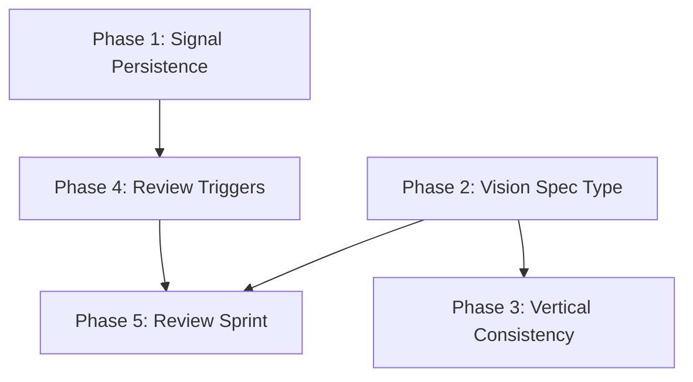

# feat: Vision Spec Lifecycle

## Enhancement Summary

**Deepened on:** 2026-01-27
**Agents used:** architecture-strategist, performance-oracle, security-sentinel, code-simplicity-reviewer, pattern-recognition-specialist, agent-native-reviewer, agent-native-architecture, best-practices-researcher

### Key Improvements
1. **SQLite replaces YAML** for signal storage — YAML grades C+ at scale, fails at 500+ signals; SQLite via `modernc.org/sqlite` (pure Go) gives durability, dedup, and concurrent safety for free
2. **Reduced to 5 phases** — Phase 6 (reverse flow) and Phase 7 (bootstrap import) cut as YAGNI; reverse flow can be added when divergence patterns are actually observed; manual YAML spec creation is simpler than a parser
3. **Security hardening** — path traversal protection, size limits on signal payloads, file locking via SQLite WAL mode
4. **Agent-native CLI** — `gurgeh signals`, `gurgeh review` subcommands so agents have parity with TUI users
5. **Start with 2 vertical checks** (Goals↔Problem, Assumptions↔Features) not 6 — expand based on actual usage

### Considerations Discovered
- Signal Store as designed has Feature Envy — business logic (weighting, thresholds) lives in persistence layer; consider separating ReviewOrchestrator
- Spec struct growing from 24→28 fields — watch for God Object; consider extracting ReviewMeta sub-struct
- Auto-accept 2s delay is agent-hostile — add `--agent-mode` flag to skip delays
- Prometheus Alertmanager grouping pattern is useful model for signal deduplication

---

## Overview

Add first-class vision document support to Gurgeh, where any project can maintain a `type=vision` spec that serves as canonical root context for all downstream PRDs. The vision spec is versioned, confidence-scored, research-informed, and periodically self-reviewed via the existing Arbiter infrastructure. Every PRD is checked for vertical alignment against the vision. Accumulated signals and time-based cadence trigger review sprints with auto-skip for healthy sections.

## Problem Statement

Autarch has all the machinery for living documents — versioned snapshots, assumption decay, consistency checking, research integration — but none of it applies to strategic documents. Vision statements sit as static markdown files outside the spec system. PRDs are created without reference to a canonical vision, so there's no mechanism to detect strategic drift.

## Proposed Solution

Five implementation phases, each independently useful:

1. **Signal persistence** — durable SQLite storage so signals survive across sessions
2. **Vision spec type** — `type=vision` on Spec schema, vision-aware loading
3. **Vertical consistency** — PRD sections checked against vision fields (start with 2 checks)
4. **Review triggers** — time-based cadence + signal accumulation
5. **Review sprint with auto-skip** — Arbiter flow seeded with existing content

## Technical Approach

### Architecture

```
                    ┌─────────────────────┐
                    │   Vision Spec       │
                    │   type=vision       │
                    │   .gurgeh/specs/    │
                    └────────┬────────────┘
                             │
              ┌──────────────┼──────────────┐
              │              │              │
              ▼              ▼              ▼
         ┌─────────┐  ┌─────────┐  ┌─────────┐
         │ PRD-001 │  │ PRD-002 │  │ PRD-003 │
         │vision_ref│  │vision_ref│  │vision_ref│
         └────┬────┘  └────┬────┘  └────┬────┘
              │              │              │
              └──────────────┼──────────────┘
                             │
                    ┌────────▼────────┐
                    │ Signal Store    │
                    │ .gurgeh/signals/│
                    │ signals.db      │
                    │ (SQLite WAL)    │
                    └────────┬────────┘
                             │
                    ┌────────▼────────┐
                    │ Review Trigger  │
                    │ check-on-load   │
                    └─────────────────┘
```

### Implementation Phases

#### Phase 1: Signal Persistence

**Problem**: Signals are currently ephemeral — `CheckSpec()` creates them in-memory. Every flow that depends on accumulation requires durable storage with deduplication.

**Files to create/modify**:

- `internal/gurgeh/signals/store.go` (NEW) — Signal store backed by SQLite
- `internal/gurgeh/signals/emitter.go` (MODIFY) — Wire emitter to store

**Design**:

```go
// internal/gurgeh/signals/store.go

// Store manages durable signal persistence in .gurgeh/signals/signals.db (SQLite WAL mode).
// Uses modernc.org/sqlite (pure Go, no CGO) — same approach as Autarch's existing SQLite usage.
type Store struct {
    db *sql.DB
}

// Schema:
// CREATE TABLE signals (
//     id TEXT PRIMARY KEY,
//     spec_id TEXT NOT NULL,
//     type TEXT NOT NULL,
//     affected_field TEXT NOT NULL,
//     severity TEXT NOT NULL,
//     description TEXT NOT NULL,
//     created_at TEXT NOT NULL,
//     dismissed_at TEXT,
//     UNIQUE(spec_id, type, affected_field) -- deduplication
// );

func NewStore(projectRoot string) (*Store, error)  // opens/creates .gurgeh/signals/signals.db
func (s *Store) Emit(sig signals.Signal) error      // INSERT OR IGNORE (dedup via unique constraint)
func (s *Store) Active(specID string) ([]signals.Signal, error)  // WHERE dismissed_at IS NULL
func (s *Store) Dismiss(id string) error
func (s *Store) Count(specID string) int            // simple count of active signals
func (s *Store) Close() error
```

**Storage**: `.gurgeh/signals/signals.db` — SQLite with WAL mode. YAML was considered but grades C+ at scale (parse-everything-on-read, no concurrent safety, vulnerable to YAML bombs). SQLite gives deduplication via UNIQUE constraint, concurrent reads, and scales to thousands of signals without degradation.

**Deduplication**: UNIQUE constraint on `(spec_id, type, affected_field)`. `Emit` uses `INSERT OR IGNORE` — if an active signal with the same key exists, it's a no-op. This prevents `CheckAssumptionDecay` from creating duplicate signals on every load.

**Signal counting**: Simple count of active signals (no weighting). The simplicity reviewer correctly identified that weighted counting (critical=3, warning=1) adds complexity without clear value — a count of active signals is sufficient for triggering reviews.

**Security**: Signal description field limited to 4KB. Database file permissions set to 0600.

**Acceptance Criteria**:
- [ ] Signals persisted to `.gurgeh/signals/signals.db` (SQLite WAL mode)
- [ ] Deduplication via UNIQUE constraint on `(spec_id, type, affected_field)`
- [ ] `Active()` returns only non-dismissed signals
- [ ] `Count()` returns simple count of active signals for a spec
- [ ] `Dismiss()` sets `dismissed_at` timestamp
- [ ] Existing `CheckSpec()` in emitter.go wired to store
- [ ] Description field capped at 4KB

---

#### Phase 2: Vision Spec Type

**Problem**: Spec struct has no `Type` field. No way to distinguish vision specs from PRDs, load them specially, or store vision-specific metadata (review cadence, last reviewed timestamp).

**Files to modify**:

- `internal/gurgeh/specs/schema.go` — Add `Type`, `LastReviewedAt`, `ReviewCadenceDays`, `VisionRef` fields to Spec
- `internal/gurgeh/specs/validate.go` — Add `"vision"` to valid types
- `internal/gurgeh/specs/evolution.go` — Add `"scheduled_review"` and `"signal_triggered_review"` trigger types
- `internal/gurgeh/arbiter/orchestrator.go` — Add `StartVision()` method, modify `Start()` to accept spec type
- `internal/gurgeh/cli/root.go` — Add `--type=vision` flag to sprint command

**Schema additions**:

```go
// Added to Spec struct in schema.go
Type              string `yaml:"type,omitempty"`                // "prd" (default), "vision"
VisionRef         string `yaml:"vision_ref,omitempty"`          // ID of vision spec this PRD aligns to
LastReviewedAt    string `yaml:"last_reviewed_at,omitempty"`    // RFC3339
ReviewCadenceDays int    `yaml:"review_cadence_days,omitempty"` // default 30
```

**Loading behavior**: When `Start()` is called for a PRD sprint in a project with a `type=vision` spec, the orchestrator auto-discovers and loads the vision spec. The vision is stored in `SprintState.VisionContext` (new field).

**Naming**: Vision specs default to `VISION-{counter}` but accept `--id` flag for custom IDs.

**Acceptance Criteria**:
- [ ] `Type` field on Spec struct, defaults to `"prd"`
- [ ] `"vision"` is a valid type in validation
- [ ] `gurgeh sprint new --type=vision` creates vision sprint
- [ ] Vision specs stored in `.gurgeh/specs/` alongside PRDs
- [ ] `VisionRef` field links PRDs to their vision spec
- [ ] `LastReviewedAt` and `ReviewCadenceDays` stored on vision specs
- [ ] Orchestrator auto-discovers vision spec when starting PRD sprint

---

#### Phase 3: Vertical Consistency Checks

**Problem**: Consistency engine only checks horizontal alignment (PRD sections vs each other). Need vertical checks: PRD sections vs vision fields.

**Files to create/modify**:

- `internal/gurgeh/arbiter/consistency/vision.go` (NEW) — Vision alignment checks
- `internal/gurgeh/arbiter/consistency/engine.go` (MODIFY) — Call vision checks when vision context present
- `internal/gurgeh/arbiter/types.go` (MODIFY) — Add `ConflictVisionAlignment` type, add `VisionContext` to SprintState
- `pkg/signals/signal.go` (MODIFY) — Add `SignalVisionDrift` type

**Vertical check mapping** — start with 2 checks, expand based on usage:

| PRD section | Vision field | Check | Ship in v1? |
|---|---|---|---|
| PhaseProblem | Goals | Problem serves at least one vision principle | ✅ |
| PhaseFeaturesGoals | Assumptions | Features don't contradict strategic bets | ✅ |
| PhaseUsers | Goals | Target users within vision scope | Later |
| PhaseScopeAssumptions | Assumptions | Scope within vision boundaries | Later |
| PhaseCUJs | CUJs | Journeys connect to vision-level workflows | Later |
| PhaseAcceptanceCriteria | Hypotheses | AC evaluable against vision predictions | Later |

**Check implementation**: Text-based keyword overlap + structural alignment. Not LLM-powered in v1 — keep it deterministic and fast. The generator already has LLM access; consistency checks should be cheap. Starting with 2 checks avoids warning fatigue and lets us calibrate sensitivity before expanding.

**Conflict behavior**: Vertical conflicts are always `SeverityWarning`, never `SeverityBlocker`. User can accept (intentional divergence) or revise. Accepted divergences recorded in `DismissedConflicts` on the PRD spec.

```go
// internal/gurgeh/arbiter/consistency/vision.go

// VisionInfo holds the loaded vision spec sections for comparison.
type VisionInfo struct {
    Goals       []string // vision principles
    Assumptions []string // strategic bets
    CUJs        []string // key workflows
    Hypotheses  []string // predictions
}

func CheckVisionAlignment(vision *VisionInfo, sections map[int]*SectionInfo) []Conflict {
    // For each PRD section, check against mapped vision field
    // Return warnings for misalignment
}
```

**Acceptance Criteria**:
- [ ] `CheckVisionAlignment` in `consistency/vision.go` implements the mapping table
- [ ] Engine calls vision checks when `VisionContext` is present on SprintState
- [ ] Conflicts are `SeverityWarning` with `ConflictVisionAlignment` type
- [ ] User can dismiss conflicts (recorded as intentional divergence)
- [ ] Dismissed conflicts stored on PRD spec as `DismissedConflicts`

---

#### Phase 4: Review Triggers

**Problem**: No mechanism to detect when a vision review is needed. Need both time-based cadence and signal accumulation triggers.

**Files to create/modify**:

- `internal/gurgeh/signals/review.go` (NEW) — Review trigger logic
- `internal/gurgeh/specs/evolution.go` (MODIFY) — Check review cadence on load

**Design**:

```go
// internal/gurgeh/signals/review.go

type ReviewStatus struct {
    NeedsReview bool
    Reason      string   // "cadence_exceeded", "signal_threshold", "both"
    DaysSince   int      // days since last review
    SignalCount int      // weighted signal count
    Signals     []Signal // active signals
}

// CheckReviewNeeded evaluates both triggers.
// Called on vision spec load (check-on-load pattern, no daemon).
func CheckReviewNeeded(spec *specs.Spec, store *Store) ReviewStatus {
    // Time check: spec.LastReviewedAt + spec.ReviewCadenceDays < now
    // Signal check: store.CountWeighted(spec.ID) >= threshold (default 5)
    // Return merged status
}
```

**Defaults**:
- Review cadence: 30 days
- Signal threshold: 3 active signals (simple count, no weighting)

**Surfacing**: When `CheckReviewNeeded` returns `NeedsReview=true`, the Gurgeh TUI shows a banner. User can trigger review, snooze (7/14/30 days), or dismiss.

**Acceptance Criteria**:
- [ ] `CheckReviewNeeded` evaluates time + signal triggers
- [ ] Time trigger: days since `LastReviewedAt` > `ReviewCadenceDays`
- [ ] Signal trigger: active count >= 3
- [ ] Both triggers can fire independently
- [ ] Review status surfaced in Gurgeh TUI as banner
- [ ] Snooze options: 7, 14, 30 days

---

#### Phase 5: Review Sprint with Auto-Skip

**Problem**: Vision reviews should use the existing Arbiter sprint flow but seeded with current content, skipping healthy sections.

**Files to create/modify**:

- `internal/gurgeh/arbiter/orchestrator.go` (MODIFY) — Add `StartReview()` method
- `internal/gurgeh/arbiter/types.go` (MODIFY) — Add `AutoAccept` field to SectionDraft
- `internal/gurgeh/tui/sprint.go` (MODIFY) — Auto-accept UX

**Design**:

```go
// StartReview loads existing vision spec into a new sprint for review.
func (o *Orchestrator) StartReview(ctx context.Context, spec *specs.Spec, activeSignals []signals.Signal) (*SprintState, error) {
    state := NewSprintState(o.projectPath)
    state.IsReview = true // new field
    state.ReviewingSpecID = spec.ID

    // Seed all sections from existing spec content
    for _, phase := range AllPhases() {
        draft := extractSectionFromSpec(spec, phase)
        draft.Status = DraftAccepted // pre-accept all

        // Check if this section has signals or decayed assumptions
        if hasFlagged(phase, activeSignals, spec) {
            draft.Status = DraftPending
            draft.AutoAccept = false
            draft.ActiveSignals = signalsForPhase(phase, activeSignals)
        } else {
            draft.AutoAccept = true
        }
        state.Sections[phase] = draft
    }
    return state, nil
}
```

**Auto-accept UX**: Sections with `AutoAccept=true` are skipped entirely — shown as "✓ [Section] — no signals" in a summary line. User can press `e` on any auto-accepted section to expand and review it manually. No 2-second delay (agent-hostile, adds nothing). Sections with `AutoAccept=false` show:
1. Current content
2. Active signals for this section
3. Arbiter's proposed changes (or "no change recommended")
4. Accept / Revise / Keep existing / Dismiss signals

**On completion**: `SaveRevision()` with trigger `"scheduled_review"` or `"signal_triggered_review"`. Update `LastReviewedAt`. Dismiss addressed signals.

**Acceptance Criteria**:
- [ ] `StartReview()` seeds sprint from existing vision spec
- [ ] Sections with signals/decay marked `AutoAccept=false`
- [ ] Sections without signals marked `AutoAccept=true`
- [ ] Auto-accept sections shown as summary line, expandable with `e`
- [ ] Flagged sections show signals + Arbiter proposal
- [ ] Consistency checks run on all sections (including auto-accepted)
- [ ] Completion creates new spec version via `SaveRevision`
- [ ] `LastReviewedAt` updated, addressed signals dismissed
- [ ] No version bump if no actual changes made

---

---

### Agent-Native CLI (cross-cutting, built alongside each phase)

**Problem**: 73% of vision lifecycle capabilities would be agent-hostile without CLI equivalents. Agents cannot interact with TUI banners, press keys, or read visual indicators.

**Files to create/modify**:

- `internal/gurgeh/cli/commands/signals.go` (NEW) — Signal management CLI
- `internal/gurgeh/cli/commands/review.go` (NEW) — Review trigger CLI

**CLI subcommands**:

```bash
# Signal management (Phase 1)
gurgeh signals list [--spec-id=X]       # JSON output of active signals
gurgeh signals dismiss <signal-id>      # Dismiss a signal

# Review management (Phases 4-5)
gurgeh review check [--spec-id=X]       # JSON: {needs_review, reason, signal_count}
gurgeh review start [--spec-id=X]       # Start review sprint (non-interactive: auto-accept all, output JSON)
```

**Agent mode**: All commands default to `--format=json` when stdout is not a TTY (detected via `os.Stdout.Fd()`). This means agents get structured output automatically.

**Acceptance Criteria**:
- [ ] `gurgeh signals list` outputs JSON array of active signals
- [ ] `gurgeh signals dismiss` dismisses by ID
- [ ] `gurgeh review check` outputs JSON review status
- [ ] Non-TTY detection for automatic JSON output
- [ ] All commands documented in `--help`

---

### Deferred: Reverse Flow & Bootstrap Import

Two phases from the original plan are deferred as YAGNI:

**Reverse flow** (PRD divergence → vision signals): Detecting when multiple PRDs diverge from vision in the same direction is valuable in theory, but requires enough PRDs to exist under a vision for patterns to emerge. Build this when divergence patterns are actually observed.

**Bootstrap import** (`gurgeh import docs/VISION.md --type=vision`): A markdown parser with heading-to-field mapping is more complex than manually creating a vision spec via `gurgeh sprint new --type=vision` and copying content. Manual creation also forces the author to validate each section — better for a document meant to be canonical.

---

## Alternative Approaches Considered

### Dedicated VisionSpec schema
Rejected: duplicates Arbiter infrastructure for marginal benefit (named fields like "Principles" instead of "Goals"). The field reinterpretation approach means zero new code paths for versioning, decay, scoring, or research.

### LLM-powered consistency checks
Rejected for v1: adds latency and non-determinism to every consistency pass. Text-based keyword overlap is fast and predictable. The Arbiter's generator already uses LLM for draft proposals — consistency should be the cheap, deterministic counterpart.

### Background daemon for review scheduling
Rejected: follows existing check-on-load pattern (same as assumption decay). No new infrastructure needed. Review is checked when the spec is loaded, not by a background process.

### Semantic similarity for divergence detection
Deferred: field-level grouping is sufficient for v1 (3 PRDs conflict on same vision field = signal). Semantic similarity adds complexity and requires embeddings infrastructure. Can be added in v2 if field-level produces too many false positives.

### YAML file for signal storage
Rejected after performance review: YAML requires parsing the entire file on every read, has no concurrent write safety, and is vulnerable to YAML bomb attacks. SQLite via `modernc.org/sqlite` (pure Go, no CGO) gives ACID transactions, WAL mode for concurrent reads, UNIQUE constraints for deduplication, and scales to thousands of signals.

### Weighted signal counting
Rejected for v1: simple count of active signals is sufficient for triggering reviews. Weighted counting (critical=3, warning=1, info=0) adds complexity without clear value — if a critical signal should trigger immediate review, that's better handled as a separate rule than as a weight multiplier.

## Acceptance Criteria

### Functional Requirements
- [ ] Vision specs created via `gurgeh sprint new --type=vision`
- [ ] Vision specs stored alongside PRDs in `.gurgeh/specs/`
- [ ] PRDs checked for vertical alignment against project's vision spec (2 checks in v1)
- [ ] Signals persisted durably in SQLite with deduplication
- [ ] Time-based and signal-based review triggers work
- [ ] Review sprint auto-skips healthy sections
- [ ] Agent-native CLI for signals and review management

### Non-Functional Requirements
- [ ] Consistency checks complete in <100ms (no LLM calls)
- [ ] Signal store handles 10,000+ signals without degradation (SQLite)
- [ ] All Intermute integration optional (graceful degradation)
- [ ] Signal description payloads capped at 4KB
- [ ] Database file permissions 0600

### Quality Gates
- [ ] Unit tests for signal store (deduplication, count, lifecycle)
- [ ] Unit tests for vertical consistency checks (2 mapping rows)
- [ ] Unit tests for review trigger logic (time, signal, both)
- [ ] Integration test: vision create → PRD create with vertical checks → review triggered → review completed
- [ ] CLI commands tested with JSON output validation

## Dependencies & Prerequisites

- Signal persistence (Phase 1) blocks Phases 4-5
- Spec schema changes (Phase 2) blocks Phases 3 and 5
- Phase 3 (vertical checks) is independent of Phases 4-5
- Phase 4 (triggers) requires Phase 1
- Phase 5 (review sprint) requires Phases 2 + 4
- Agent-native CLI built alongside each phase



## Risk Analysis & Mitigation

| Risk | Impact | Mitigation |
|------|--------|------------|
| Import cycle when adding VisionContext to SprintState | Build breaks | Use local adapter pattern (documented in `docs/solutions/`) |
| Signal deduplication key too broad/narrow | Spam or missed signals | Start with `(spec_id, type, field)`, tune based on usage |
| Vertical checks too noisy | Users ignore all warnings | Start with 2 checks (Goals↔Problem, Assumptions↔Features), expand based on usage |
| Spec struct growing (24→28 fields) | God Object risk | Extract `ReviewMeta` sub-struct if struct exceeds 30 fields |
| Path traversal in spec loading | Security | Validate spec paths are within `.gurgeh/` directory; reject `..` components |
| Signal store DoS via large payloads | Resource exhaustion | Cap description field at 4KB, use SQLite page size limits |

## References & Research

### Internal References
- Brainstorm: `docs/brainstorms/2026-01-27-vision-lifecycle-brainstorm.md`
- Vision doc: `docs/VISION.md`
- Spec schema: `internal/gurgeh/specs/schema.go:120-145`
- Orchestrator: `internal/gurgeh/arbiter/orchestrator.go:66-172`
- Consistency engine: `internal/gurgeh/arbiter/consistency/engine.go:25-46`
- Signal types: `pkg/signals/signal.go:11-40`
- Spec evolution: `internal/gurgeh/specs/evolution.go:40-162`
- Research phases: `internal/gurgeh/arbiter/research_phases.go:3-60`
- Import cycle solution: `docs/solutions/patterns/arbiter-spec-sprint-architecture.md`
- TUI dimension gotcha: `docs/solutions/ui-bugs/tui-dimension-mismatch-splitlayout-20260126.md`
